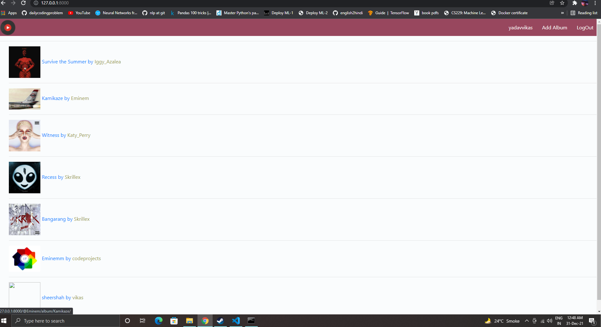
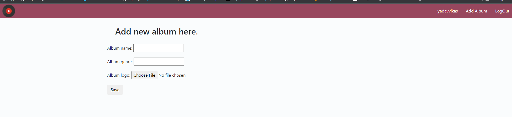
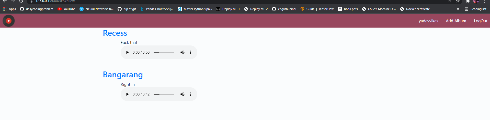
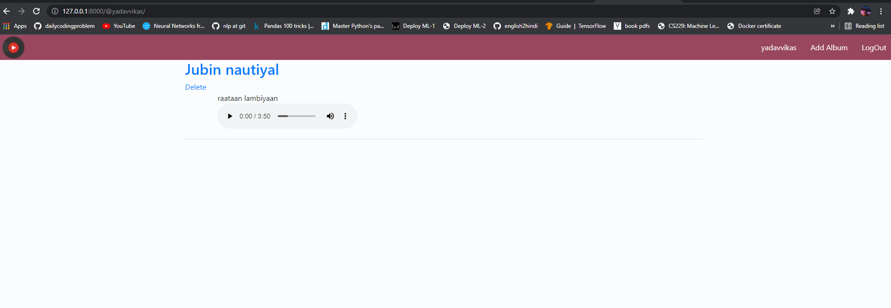
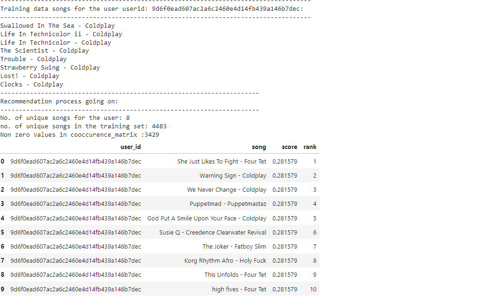

# Music player

A simple music player built on top on django-framework.

### Features
It allows you to:
 - Add new albums 

  

 - Add songs to Albums

   

 - songs and Albums by user

   

 - music suggesions as well

   


### Installing Django 

Either install from packages by typing these commands in your terminal
```
sudo apt-get update
sudo apt-get install python-django
```
You can confirm whether its installed or not by typing 
```
django-admin --version
```

Other way is installing by using pip 
```
sudo apt-get update
```
Install pip if you dont have by 
```
sudo apt-get install python-pip
```
Then install django by 
```
sudo pip install django
```

### Running the code 
Just go into the code directory and type 
```
python manage.py runserver
```

 
### Applying Migrations on the Project 
Migrations are Django’s way of propagating changes you make to your models (adding a field, deleting a model, etc.) into your database schema. They’re designed to be mostly automatic, but you’ll need to know when to make migrations, when to run them, and the common problems you might run into.
Now suppose you want to change my album'm model or song's model and have your's you can simply change the code as you require and then run these commands
```
python manage.py makemigrations
python manage.py migrate 
python manage.py runserver
```
You can use *showmigration*  to list projects migration.


   
